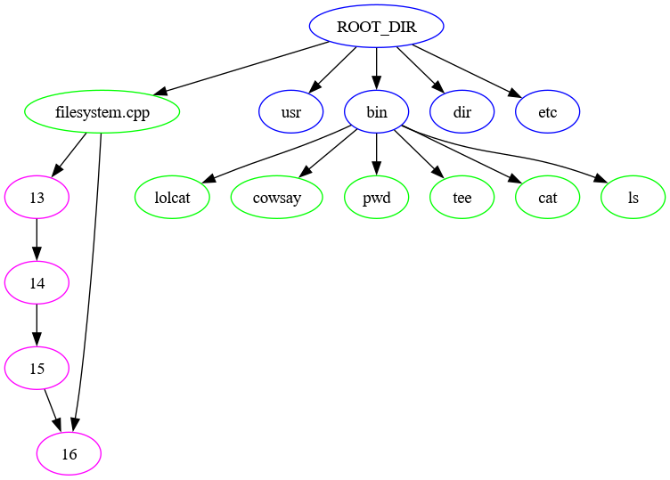

# Filesystem

This repository contains our final project for CSC 310.
It is a simple filesystem written in C++.
It uses a doubly linked list for file storage (similar to FAT), an AVL tree to sort directory entry children, a heap for sector allocation, hashmaps for mapping names of children to sector indices, and the filesystem tree is modeled as a trie where each entry is a path component.

### Constructors
```cpp
// Uses a disk mapped to memory (Backed by something, or not)
MyFilesystem(sector_union_t* disk, uint64_t disk_size);
// Uses a disk image on the filesystem (Internally uses mmap)
MyFilesystem(string path);
// Creates an in-memory disk of the specified size. Lost on exit.
MyFilesystem(sector_t sectors);
```

### Functions for manipulating the filesystem tree
```cpp
// Creates a file with the given name in the given directory
sector_t create(string name, sector_t dir);
// Creates a directory with the given name in the given directory
sector_t mkdir(string name, sector_t dir);
```

### Functions for working with files
```cpp
// Opens a file and returns a file descriptor
int open(string path);
int open(sector_t entry);
// Closes an open file descriptor
void close(int fd);
// Truncates a file, making it end at the current position
void trunc(int fd);
// Reads data from the file into the given buffer, incrementing the position
// Returns the number of bytes read
uint64_t read (int fd, uint8_t *buf, uint64_t count);
// Writes data from the given buffer to the file, incrementing the position
// Returns the number of bytes written
uint64_t write(int fd, uint8_t *buf, uint64_t count);
// Moves the position within the file handle
// The whence acts like the standard POSIX whence
// Returns the new position in the file.
uint64_t seek(int fd, int64_t offset, int whence);
// Returns true if the position is at the end of the file
bool eof(int fd);
```

### Debugging functions
Both of these functions dump internal data structures to the given path in the DOT format.
The file can be converted to an image using graphviz, and viewed with your image viewer of choice.
Example: `dot -Tpng -o dump.png dump.txt`

```cpp
// Dumps the state of the allocator heap
void debug_heap(string path);

// Dumps the state of the entire filesystem
// Directories are blue
// Files are green
// Data nodes are magenta
void debug_tree(string path);
```

